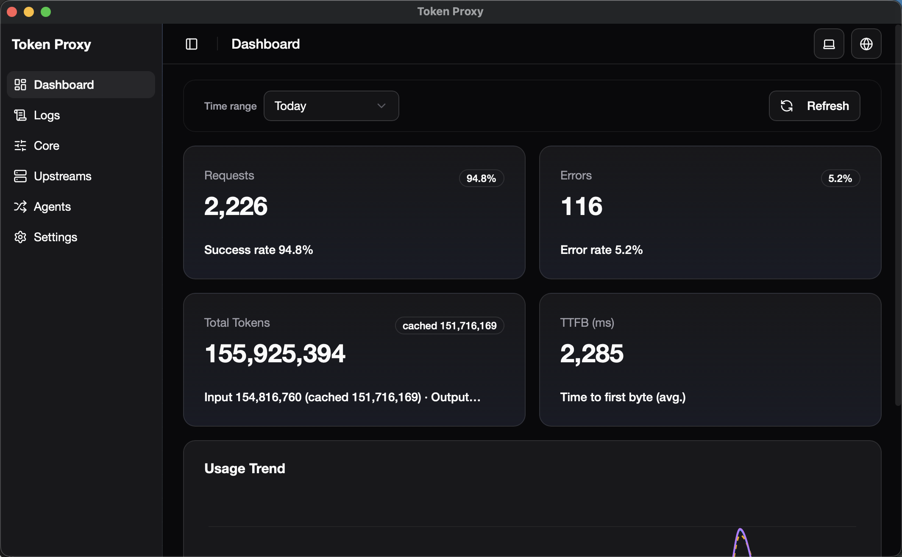
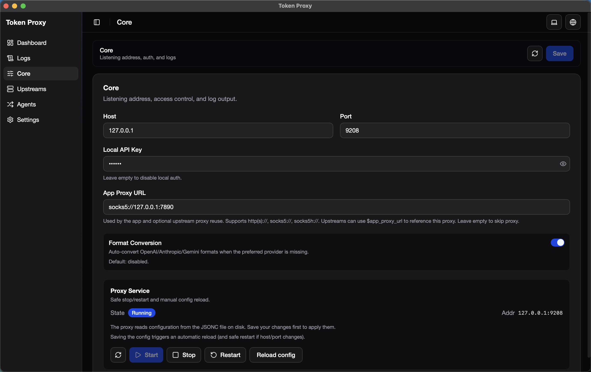
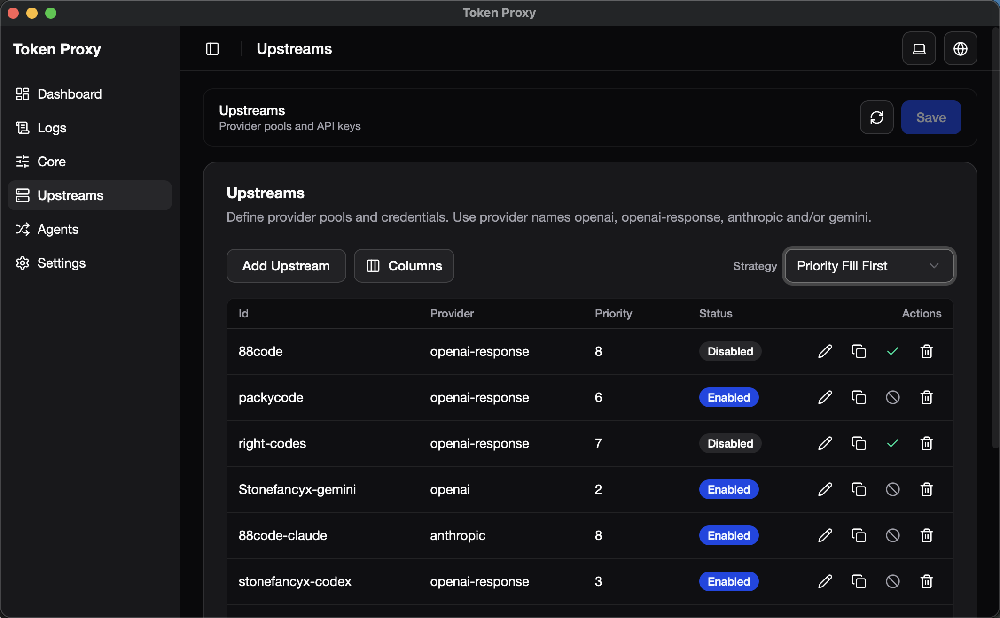
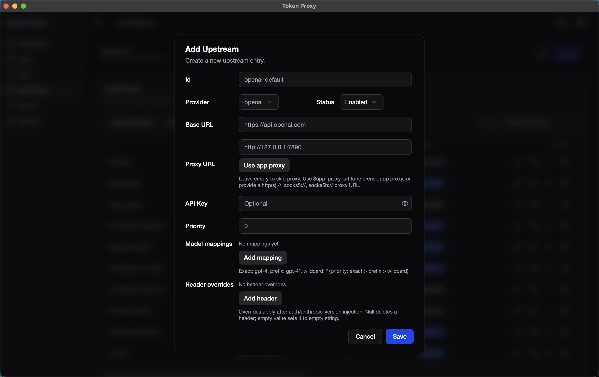

# Token Proxy

English | [中文](README.zh-CN.md)

Local AI API gateway for OpenAI / Gemini / Anthropic. Runs on your machine, keeps tokens counted (SQLite), offers priority-based load balancing, optional API format conversion (OpenAI Chat/Responses ↔ Anthropic Messages, plus Gemini ↔ OpenAI/Anthropic, including SSE/tools/images), and one-click setup for Claude Code / Codex.

> Default listen port: **9208** (release) / **19208** (debug builds).

---

## What you get
- Multiple providers: `openai`, `openai-response`, `anthropic`, `gemini`, `kiro`, `codex`, `xai`
- Built-in routing + optional format conversion (OpenAI Chat ⇄ Responses; Anthropic Messages ↔ OpenAI; Gemini ↔ OpenAI/Anthropic; SSE supported)
- **Upstream is the only scheduling unit**: priority, proxy, enabled, models, and credential live on each upstream entry
- No separate Accounts / Providers page — on **Upstreams**, use **Add Account** to log in or import Kiro / Codex / xAI; the same editor manages identity, quota, token refresh / auto-refresh (where the provider supports it), and routing
- Account-backed upstreams: one account maps to one stable upstream; deleting it cascades account credentials; copy is disabled
- Model alias mapping (exact / prefix* / wildcard*) and response model rewrite
- Local access key + upstream credential injection (`credential.api_keys` or request-header fallback when local auth is off)
- SQLite-powered dashboard (requests, tokens, cached tokens, latency, recent)
- macOS tray live token rate (optional)

## Screenshots
|  |  |
| --- | --- |
| **Dashboard**<br> | **Core**<br> |
| **Upstreams**<br> | **Add upstream**<br> |

## Quick start (macOS)
1) Install: move `Token Proxy.app` to `/Applications`. If blocked: `xattr -cr /Applications/Token\ Proxy.app`.
2) Launch the app. The proxy starts automatically.
3) Open **Config File** tab, edit and save (writes `config.jsonc` in the Tauri config dir). Defaults are usable; just paste your upstream API keys. Running proxies auto-apply the new config via reload or restart when needed.
4) Call via curl (example with local auth):
```bash
curl -X POST \
  -H "Authorization: Bearer YOUR_LOCAL_KEY" \
  -H "Content-Type: application/json" \
  http://127.0.0.1:9208/v1/chat/completions \
  -d '{"model":"gpt-4.1-mini","messages":[{"role":"user","content":"hi"}]}'
```

You can also call using the Anthropic Messages format (useful for Claude Code clients):
```bash
curl -X POST \
  -H "x-api-key: YOUR_LOCAL_KEY" \
  -H "Content-Type: application/json" \
  http://127.0.0.1:9208/v1/messages \
  -d '{"model":"claude-3-5-sonnet-20241022","max_tokens":256,"messages":[{"role":"user","content":[{"type":"text","text":"hi"}]}]}'
```

## Workspace & CLI (Rust)
- This repo is now a Cargo workspace; the Tauri app still lives in `src-tauri/`.
- CLI crate: `crates/token_proxy_cli` (binary `token-proxy`).
- Default config path: `./config.jsonc` (override with `--config`).
- GitHub Releases also publish packaged CLI archives per target:
  - Unix: `token-proxy_cli_<version>_<target>.tar.gz`
  - Windows: `token-proxy_cli_<version>_<target>.zip`

```bash
# start proxy
cargo run -p token_proxy_cli -- serve

# start with custom config path
cargo run -p token_proxy_cli -- --config ./config.jsonc serve

# config helpers
cargo run -p token_proxy_cli -- config init
cargo run -p token_proxy_cli -- --config ./config.jsonc config path
```

## Frontend tests
```bash
# watch mode
pnpm test

# run once (CI-friendly)
pnpm test:run

# coverage (optional)
pnpm test:coverage

# TypeScript typecheck
pnpm exec tsc --noEmit
```

Notes:
- Test files live in `src/**/*.test.{ts,tsx}`.
- Global test setup (Tauri mocks + jsdom polyfills) is in `src/test/setup.ts`.
- Vitest config is in `vitest.config.ts`.

## Configuration reference
- File: `config.jsonc` (comments + trailing commas allowed)
- Location:
  - CLI: `--config` (default: `./config.jsonc`)
  - Tauri: **AppConfig** directory (resolved automatically by the app)

### Core fields
| Field | Default | Notes |
| --- | --- | --- |
| `host` | `127.0.0.1` | Listen address (IPv6 allowed; will be bracketed in URLs) |
| `port` | `9208` release / `19208` debug | Change if the port is taken |
| `local_api_key` | `null` | When set: local auth uses format-specific headers (see Auth rules); local auth inputs are **not** forwarded upstream. |
| `app_proxy_url` | `null` | Proxy for app updater & as placeholder for upstreams (`"$app_proxy_url"`). Supports `http/https/socks5/socks5h`. |
| `log_level` | `silent` | `silent|error|warn|info|debug|trace`; debug/trace log request headers (auth redacted) and small bodies (≤64KiB). Release builds force `silent`. |
| `max_request_body_bytes` | `104857600` (100 MiB) | 0 = fallback to default. Shared inbound, JSON filter, and format-conversion ceiling. |
| `retryable_failure_cooldown_secs` | `15` | Cooldown window after retryable failures that should temporarily sideline an upstream. `0` disables cooldown. Reloading or restarting the running proxy resets current cooldown state. |
| `same_upstream_retry_count` | `1` | Extra same-upstream retries after a retryable failure (excluding the first attempt). `0` disables same-upstream retry; max `5`. |
| `codex_session_scoped_cooldown_enabled` | `false` | Only applies to Codex account-backed OpenAI Responses requests. When enabled, cooldown is isolated by `session_id`; final success clears that session, and requests without `session_id` do not share cooldown. |
| `tray_token_rate.enabled` | `true` | macOS tray live rate; harmless elsewhere. |
| `tray_token_rate.format` | `split` | `combined` (`total`), `split` (`↑in ↓out`), `both` (`total | ↑in ↓out`). |
| `upstream_strategy` | `{ "order": "fill_first", "dispatch": { "type": "serial" } }` | Structured strategy object. `order` controls candidate ordering inside one priority group; `dispatch` controls serial / hedged / race execution. |

### Upstream entries (`upstreams[]`)
| Field | Default | Notes |
| --- | --- | --- |
| `id` | required | Unique per upstream. |
| `providers` | required | One upstream can serve multiple providers. Account-based providers `kiro` / `codex` / `xai` must be alone (cannot mix with each other or with API-key providers). |
| `base_url` | required | Full base; overlapping path parts are de-duplicated. (`providers=["kiro"]` / `["codex"]` can be empty; `xai` account-backed uses the fixed CLI gateway base.) |
| `credential` | `{ "type": "passthrough" }` | **Discriminated union** — the only credential shape. See below. |
| `preferred_endpoint` | `null` | `kiro` only: `ide` or `cli`. |
| `proxy_url` | `null` | Per-upstream proxy (not an account field); supports `http/https/socks5/socks5h`; default is **no system proxy**. `$app_proxy_url` placeholder allowed. |
| `priority` | `0` | Per-upstream scheduling weight (not an account field). Higher = tried earlier. |
| `enabled` | `true` | Per-upstream toggle (not an account field). Disabled upstreams are skipped. |
| `available_models` | `[]` | Inbound model allowlist; empty = no restriction. |
| `model_mappings` | `{}` | Exact / `prefix*` / `*`. Priority: exact > longest prefix > wildcard. Response echoes original alias. |
| `convert_from_map` | `{}` | Explicitly allow inbound format conversion per provider. Example: `{ "openai-response": ["openai_chat", "anthropic_messages"] }`. |
| `overrides.header` | `{}` | Set/remove headers (null removes). Hop-by-hop/Host/Content-Length are always ignored. |

#### `credential` (required shape)

| `type` | Shape | Notes |
| --- | --- | --- |
| `passthrough` | `{ "type": "passthrough" }` | No static upstream key; may rely on request-header fallback when `local_api_key` is unset. **Not allowed** for `kiro` / `codex` / `xai`. |
| `api_keys` | `{ "type": "api_keys", "api_keys": ["key-a", "key-b"] }` | Static keys; empty list behaves like passthrough after normalize. **Not allowed** for account-based providers. |
| `account` | `{ "type": "account", "provider": "kiro"\|"codex"\|"xai", "account_id": "..." }` | Binds one Provider Account. `provider` must match the sole account-based entry in `providers[]`. One `(provider, account_id)` may bind only one upstream. |

Kiro / Codex / xAI **must** use `credential.type = "account"`. Account login/import creates a stable binding via app lifecycle; do not invent frontend-only ids such as `kiro-default` / `codex-default` / `xai-default`. Deleting an account-backed upstream **cascades** deletion of that account credential; **copy is forbidden**.

Legacy flat fields (`api_key`, `api_keys`, `kiro_account_id`, `codex_account_id`, `xai_account_id`) are **not** part of the documented schema. On load they are migrated once into `credential` and written back (no dual-format docs).

## Routing & format conversion
- Gemini native API: `/v1beta/models/*` (including `:generateContent`, `:streamGenerateContent`, `:countTokens`, `:embedContent`, `:batchEmbedContents`), model catalog/detail, `/v1beta/files*`, `/upload/v1beta/files*`, `/v1beta/cachedContents*`, `/v1beta/tunedModels*` → `gemini`.
- Anthropic: `/v1/messages` (and subpaths) and `/v1/complete` → `anthropic` (Kiro shares the same format).
- OpenAI create routes: `/v1/chat/completions` → `openai`; `/v1/responses` → `openai-response`.
- OpenAI native pass-through routes are explicitly pinned to OpenAI-compatible providers and won't fall through to `anthropic`: `chat/completions/*`, `responses/*`, `assistants*`, `threads*`, `conversations*`, `chatkit*`, `containers*`, `evals*`, `files*`, `uploads*`, `batches*`, `vector_stores*`, `images/*`, `audio/*`, `embeddings`, `moderations`, `completions`, `fine_tuning/*`, `realtime/*`, `skills*`, `videos*`.
- For `responses/*` resources, provider preference is `openai-response` → `openai`; for other OpenAI native resources, provider preference is `openai` → `openai-response`.
- Other paths: choose the provider with the highest configured priority; tie-break is `openai` > `openai-response` > `anthropic`.
- Cross-format fallback/conversion is controlled by `upstreams[].convert_from_map` (no global switch). If a provider has no eligible upstream for the inbound format, it won't be selected.
- If `openai` is missing for `/v1/chat/completions`: fallback can be `openai-response`, `anthropic`, or `gemini` (priority-based; tie-break prefers `openai-response`).
- For `/v1/messages`: choose between `anthropic` and `kiro` by priority; tie-break uses upstream id. If the chosen provider returns a retryable error, the proxy will fall back to the other native provider (Anthropic ↔ Kiro) when configured.
- If neither `anthropic` nor `kiro` exists for `/v1/messages`: other providers can be selected only when allowed for `anthropic_messages` via `convert_from_map` (e.g. `openai-response`, `openai`, `gemini`).
- If `openai-response` is missing for `/v1/responses`: fallback can be `openai`, `anthropic`, or `gemini` (priority-based; tie-break prefers `openai`).
- If `gemini` is missing for `/v1beta/models/*:generateContent` or `*:streamGenerateContent`: fallback can be `openai-response`, `openai`, or `anthropic` (priority-based; tie-break prefers `openai-response`).
- Other Gemini native endpoints are pass-through only and require a configured `gemini` upstream.

## Auth rules (important)
- Local access: `local_api_key` enabled → require format-specific key. Local auth inputs are reserved for gateway access and **not** used as upstream credentials.
  - Public whitelist: `GET` / `HEAD` `/v1/models` and `/v1beta/openai/models` do not require local key.
  - OpenAI / Responses: `Authorization: Bearer <key>`
  - Anthropic `/v1/messages`: `x-api-key` or `x-anthropic-api-key`
  - Gemini native API: `x-goog-api-key` or `?key=...`
- When `local_api_key` is enabled, inbound request auth headers are **not** collected for upstream; configure `credential.api_keys` (or an account credential) on the upstream instead.
- Upstream auth resolution (per request; runtime expands `credential.api_keys` into the attempt key):
  - **OpenAI-compatible** (and most non-Anthropic providers): `credential.api_keys` → request `x-openai-api-key` / `Authorization` **only when** `local_api_key` is unset → no key.
  - **Anthropic**: `credential.api_keys` → request `x-api-key` / `x-anthropic-api-key` / bearer fallback **only when** `local_api_key` is unset → no key. Missing `anthropic-version` is auto-filled with `2023-06-01`.
  - **Gemini**: `credential.api_keys` → request `x-goog-api-key` → query `?key=...` (query/header fallback only when `local_api_key` is unset) → skip attempt.
  - **Account-backed** (`kiro` / `codex` / `xai`): uses the bound Provider Account identity (OAuth / Agent Assertion); not `api_keys`.

## Load balancing & retries
- Priorities: higher `priority` groups first.
- `upstream_strategy.order` controls selection inside the same priority group:
  - `fill_first`: keep the configured list order.
  - `round_robin`: rotate the starting point across requests.
- `upstream_strategy.dispatch` controls how requests are launched inside one priority group:
  - `{"type":"serial"}`: try one candidate at a time.
  - `{"type":"hedged","delay_ms":2000,"max_parallel":2}`: launch the first candidate immediately, then add one more attempt after `delay_ms` if the prior attempt is still unresolved, up to `max_parallel`.
  - `{"type":"race","max_parallel":3}`: launch up to `max_parallel` candidates immediately and take the first successful result.
- Retryable conditions: network timeout/connect errors, or status 400/401/403/404/408/413/422/429/307/5xx (including 504/524). Non-context-window 413 responses skip same-upstream retry and fail over directly; context-window errors remain terminal.
- Explicit Responses field rejections and xAI invalid encrypted reasoning use bounded same-identity request repair before ordinary retry/failover. Repair retries do not consume `same_upstream_retry_count`, and the repaired body is retained for later attempts.
- Same-upstream retry: on a retryable failure, retry the **same upstream** up to `same_upstream_retry_count` extra times (default `1`, excluding the first attempt) before failing over. After the first client-visible stream output, the proxy does not replay the same attempt.
- Cooldown conditions: `401/403/408/429/5xx` will temporarily move the failed upstream behind ready peers for `retryable_failure_cooldown_secs` (default `15`); `400/404/422/307` stay retryable but do not trigger cross-request cooldown. With `codex_session_scoped_cooldown_enabled=true`, Codex account-backed OpenAI Responses cooldown is isolated by `session_id`; final successful requests do not keep same-session cooldown, and requests without `session_id` do not share cooldown.
- `/v1/messages` only: after the chosen native provider is exhausted (retryable errors), the proxy can fall back to the other native provider (`anthropic` ↔ `kiro`) if it is configured.

## Observability
- SQLite log: `data.db` in config dir. Stores per-request stats (tokens, cached tokens, latency, model, upstream).
- Token rate: macOS tray shows live total or split rates (configurable via `tray_token_rate`).
- Debug/trace log bodies capped at 64KiB.

## Dashboard
- In-app **Dashboard** page visualizes totals, token usage trend, **model usage** ranking (Top 20), and upstream model probes
- Time range, upstream, and account filters apply to summary / series / models
- Recent requests live on the **Logs** page (page size 50, offset supported)
- The Logs panel supports a 30-second request-detail capture window: when enabled it stores request headers/bodies during that window, always keeps error responses for failed requests, and turns off automatically afterward.

## One-click CLI setup
- Claude Code: writes `~/.claude/settings.json` `env` (`ANTHROPIC_BASE_URL`, `ANTHROPIC_MODEL=claude-sonnet-4-6`, `ANTHROPIC_AUTH_TOKEN` when local key is set).
- Codex: writes `~/.codex/config.toml` `model="gpt-5.5"`, `model_provider="token_proxy"`, and `[model_providers.token_proxy].base_url` → `http://127.0.0.1:<port>/v1`; writes `~/.codex/auth.json` `OPENAI_API_KEY`.
- A `.token_proxy.bak` file is created before overwriting; restart the CLI to apply.

## FAQ
- **Port already in use?** Change `port` in `config.jsonc`; remember to update your client base URL.
- **Got 401?** If `local_api_key` is set, you must send the format-specific local key (OpenAI/Responses: `Authorization`, Anthropic: `x-api-key`, Gemini: `x-goog-api-key` or `?key=`). With local auth enabled, configure upstream keys in `upstreams[].credential` (`api_keys` or `account`).
- **Got 504?** Upstream did not send response headers or the first body chunk within 120s. For streaming responses, a 120s idle timeout between chunks may also close the connection.
- **413 Payload Too Large?** Body exceeded `max_request_body_bytes` (default 100 MiB) or the transform limit for format-conversion requests.
- **Why no system proxy?** By design, `reqwest` is built with `.no_proxy()`; set per-upstream `proxy_url` if needed.
